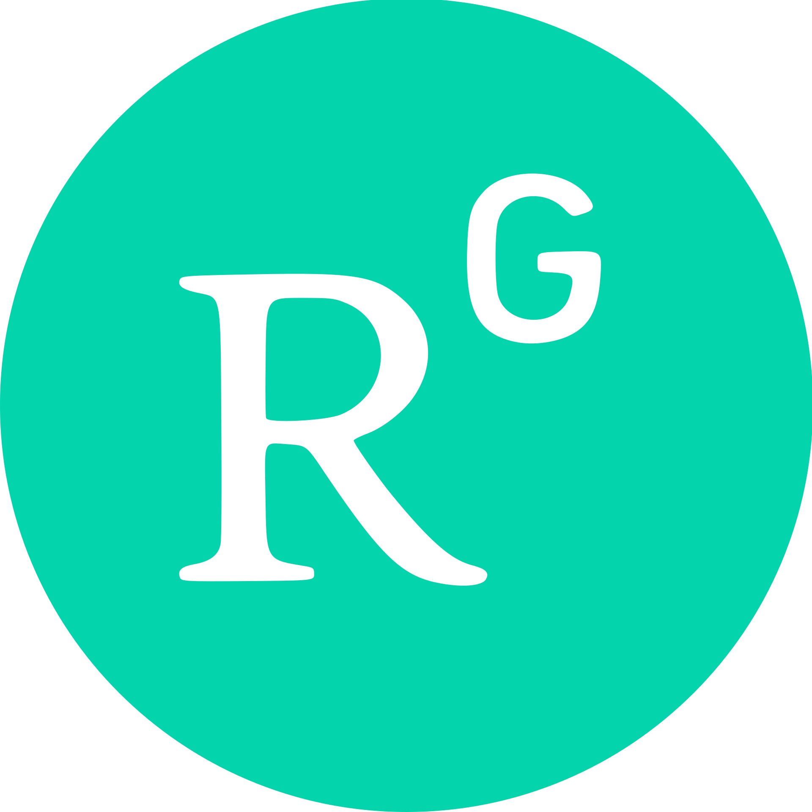

## Qi Tang 
Assistant Professor 
[School of Computational Science and Engineering](https://cse.gatech.edu) 
[Georgia Institute of Technology](https://www.gatech.edu/)

**Email:** [qtang@gatech.edu](mailto:qtang@gatech.edu)  
**Office:** Coda at Tech Square, S1373B
  

 
I am an Assistant Professor in the School of Computational Science and Engineering ([CSE](https://cse.gatech.edu/)) at the Georgia Institute of Technology. From 2018 to 2024, I was a Postdoc and later converted to a Scientist in the Applied Mathematics and Plasma Physics Group ([T-5](https://www.lanl.gov/org/ddste/aldsc/theoretical/applied-mathematics-plasma-physics/index.php)) in the Theoretical Division at Los Alamos National Laboratory (LANL). Prior to that, from 2015 to 2018, I was an Eliza Ricketts Foundation Postdoctoral Fellow at Rensselaer Polytechnic Institute. I received my Ph.D. in Applied Math from Michigan State University in 2015 and B.S. in Math & Applied Math from Zhejiang University in 2010. 

I am a computational scientist and applied mathematician by training. My research goal is to leverage modern computational science tools for physics applications. My research heavily relies on open-source packages such as [`MFEM`](https://mfem.org/), [`PETSc`](https://petsc.org/), [`p4est`](https://www.p4est.org/), [`Overture`](https://www.overtureframework.org/), and [`hypre`](https://hypre.readthedocs.io/) for development of scalable physics codes. Additionally, I am interested in exploring scientific machine learning (SciML) in those physics applications. My primary physics interests are magnetic confinement fusion and plasma physics (e.g., MHD turbulence and plasma-based accelerators).

During my career at LANL, my research was mainly supported by DOE Office of Science's Advanced Scientific Computing Research (ASCR) and Fusion Energy Sciences (FES) programs,
 including their joint SciDAC program. 
My research was also supported by several LANL Laboratory Directed Research and Development (LDRD) programs and NSF (MSGI and DMS).

<b>I have multiple Ph.D. student openings in the School of CSE at Georgia Tech starting in Fall 2025. The Ph.D. projects can involve one or multiple areas from the research interests listed below. If there is sufficient interest, students can undertake a summer internship at one of the DOE national labs. I also strongly support my students in pursuing diverse career paths that align with their interests. If you are interested in joining my team, please email me. Please note that Ph.D. students in the CSE program can have a home unit in a different school. Therefore, I am also interested in accepting students in mathematics or physics.</b>

## Research interests
* **High-performance computing:** high-order schemes, scalable iterative solvers, preconditioning, adaptive mesh refinement, GPU accelerations
* **Scientific computing and simulations:** multiscale and multiphysics problems, fusion whole device modeling, computational plasma physics, fluid-structure interaction
* **AI/ML:** structure-preserving machine learning, dynamical system learning, ML-based surrogates

## Partnership 
* I am part of the DOE ASCR MMICC Center for Hierarchical and Robust Modeling of Non-Equilibrium Transport ([CHaRMNET](https://charmnet-mmicc.github.io/)).
* I lead a multi-institional ASCR SciML team involving LANL, ANL, IIT, John Hopkins, and Penn State.
* I was part of the DOE FES Tokamak Disruption Simulation ([TDS](https://tds-scidac.github.io/)) SciDAC center.

 

<!-- **Address:** School of Computational Science and Engineering, Georgia Institute of Technology, Atlanta, GA 30332.   -->
