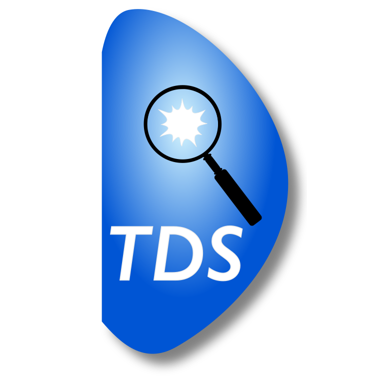

# Tokamak Disruption Simulation (TDS) SciDAC center

The primary objective of the TDS Center is to help establish the
physics basis for effective disruption mitigation in a reactor-size
tokamak through large-scale simulations, using the largest computers
available.  To reach this ambitious goal, the TDS Center aims to
simultaneously advance the frontiers of disruption physics and
advanced simulation.  In particular, the TDS Team develops
cutting-edge _scalable_, _adaptive_, _high-order_ algorithms for
tokamak simulations.

## Highlights

* Advanced scalable algorithms design and development for tokamak simulations
* Extended magnetohydrodynamic simulation of flux surface breakup and global field line stochasticization
* Transport (fully kinetic, gyrokinetic, and gyrofluid) calculations of particle and energy in 3D magnetic fields
* Multi-fluid and kinetic calculation of plasma/neutral and plasma/pellet interaction
* Collisional-radiative modeling of a disrupting plasma with high-Z impurities and runaway electrons
* Self-consistent kinetic calculations of runaway generation and transport

## News

Date             | Message
---------------- | -----------------------------------------------------------------
Jun 22, 2022     | TDS team members will give invited talks at [APS-DPP](https://engage.aps.org/dpp/meetings/annual-meeting). 
Jun 21, 2022     | Luis Chacon (LANL) was awarded the [EO Lawrence Award](https://science.osti.gov/lawrence).
Apr 11, 2022     | Luis Chacon (LANL) organized 2 sessions at the [CMCIM](https://easychair.org/smart-program/CM2022/2022-04-04.html).
Apr 11, 2022     | John Shadid (SNL) co-chairs the [CMCIM](https://easychair.org/smart-program/CM2022/).
Apr 4, 2022      | TDS team members attend [Sherwood Fusion Theory Conference](https://www.sherwoodtheory.org/sw2022/index.php). 

