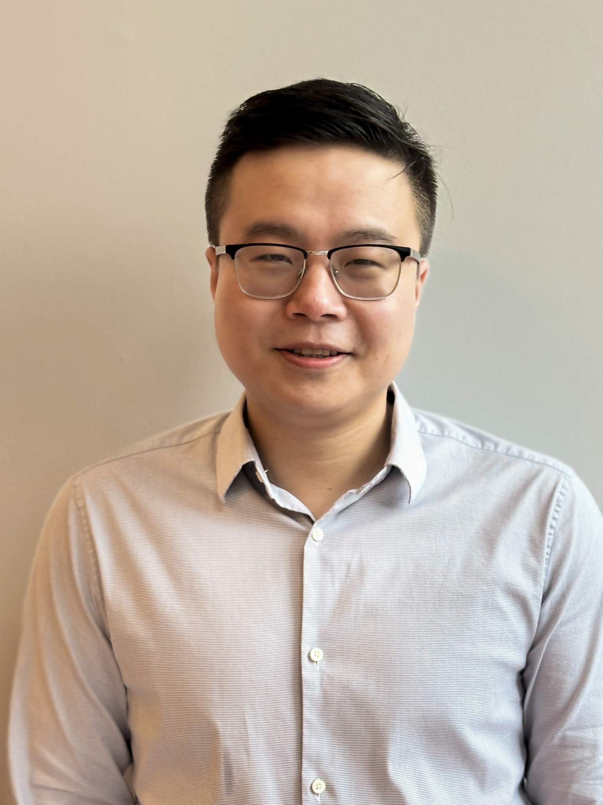
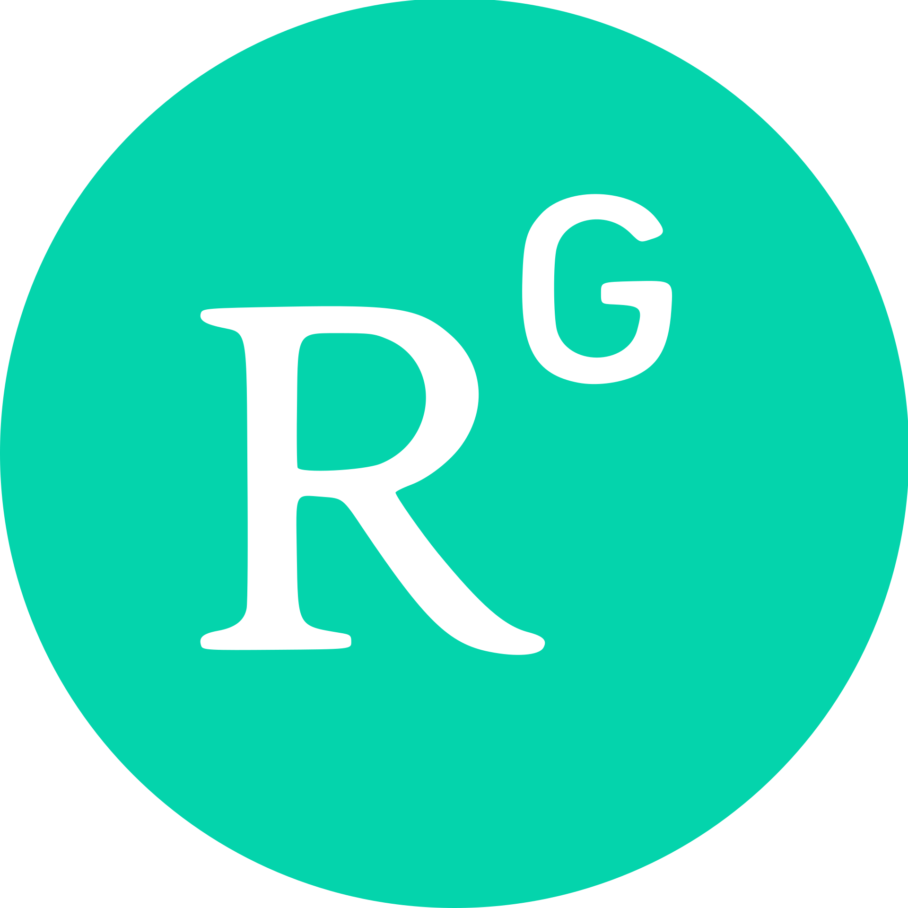

## Qi Tang 
Assistant Professor 
[School of Computational Science and Engineering](https://cse.gatech.edu) 
[Georgia Institute of Technology](https://www.gatech.edu/)

Guest Scientist 
[Los Alamos National Laboratory](https://www.lanl.gov/)

**Email:** [qtang@gatech.edu](mailto:qtang@gatech.edu) and [qtang@lanl.gov](mailto:qtang@lanl.gov) 
**Office:** Coda at Tech Square, S1373B
  

 
I am an Assistant Professor in [CSE](https://cse.gatech.edu/) at Georgia Institute of Technology. Prior to joining Georgia Tech, I was a Scientist in the Theoretical Division at Los Alamos National Laboratory (LANL). I am a computational scientist and applied mathematician by training, with a strong interest in physics, particularly **fusion energy** and **plasma physics**. I rely on open-source libraries such as  [`MFEM`](https://mfem.org/), [`PETSc`](https://petsc.org/), [`p4est`](https://www.p4est.org/), [`Overture`](https://www.overtureframework.org/), and [`hypre`](https://hypre.readthedocs.io/) to develop scalable, high-performance numerical solvers. I also work on scientific machine learning (SciML) to enhance traditional  solvers.

<b>
I have several PhD student positions in Fall 2026. The projects can involve one or multiple areas from the research interests listed below. If there is sufficient interest, students can undertake a summer internship at one of the DOE national labs. If you are interested in joining my group, please email me with your CV.

Please note that Ph.D. students in the CSE and ML programs can have a home unit in a different school. Therefore, I also accept students in mathematics, physics, and engineering (AE/ME/ECE). However, students must first be admitted by their respective home units. Therefore, if you are strongly interested in working with me, I encourage you to select College of Computing as your home unit.
</b>

## Research interests
* **High-performance computing:** high-order schemes, particle-in-cell, scalable iterative solvers, preconditioning, adaptive mesh refinement, GPU accelerations
* **Scientific computing and simulations:** multiscale and multiphysics problems, fusion modeling, computational plasma physics
* **AI/ML and data science:** structure-preserving ML, dynamical system learning, scale bridging, ML-based surrogates, denoising, Bayesian inference

## Partnership 
* I am part of an NNSA PSAAP FIC: Center for High Order Plasma Turbulence Modeling for Z-Pinch ([HighZ](https://highz-fic.github.io/))
* I am part of an NNSA PSAAP FIC: Center for Information Geometric Mechanics and Optimization ([CIGMO](https://cigmo.github.io/))
* I am part of the DOE ASCR MMICC Center for Hierarchical and Robust Modeling of Non-Equilibrium Transport ([CHaRMNET](https://charmnet-mmicc.github.io/)).
* 2021–2025, I was the lead PI for a DOE ASCR SciML team involving LANL, ANL, IIT, JHU, and PSU.
* 2018–2023, I was part of the DOE FES Tokamak Disruption Simulation SciDAC center ([TDS](https://tds-scidac.github.io/)).

## Awards
* Summer Early Career Scholar, KTH Royal Institute of Technology, 2026
* DOE Early Career Award (ECRP), 2025

 

<!-- **Address:** School of Computational Science and Engineering, Georgia Institute of Technology, Atlanta, GA 30332.
*Due to the nature of the physics and math problems I work on, algorithm development typically requires a year or more of effort. As a result, I do not offer short-term internship positions.*
  -->
