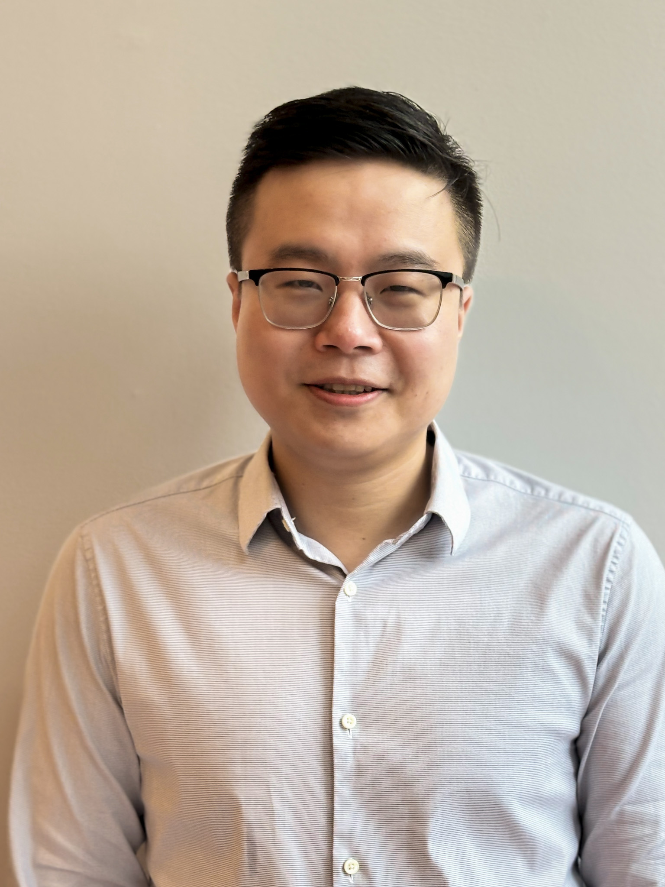
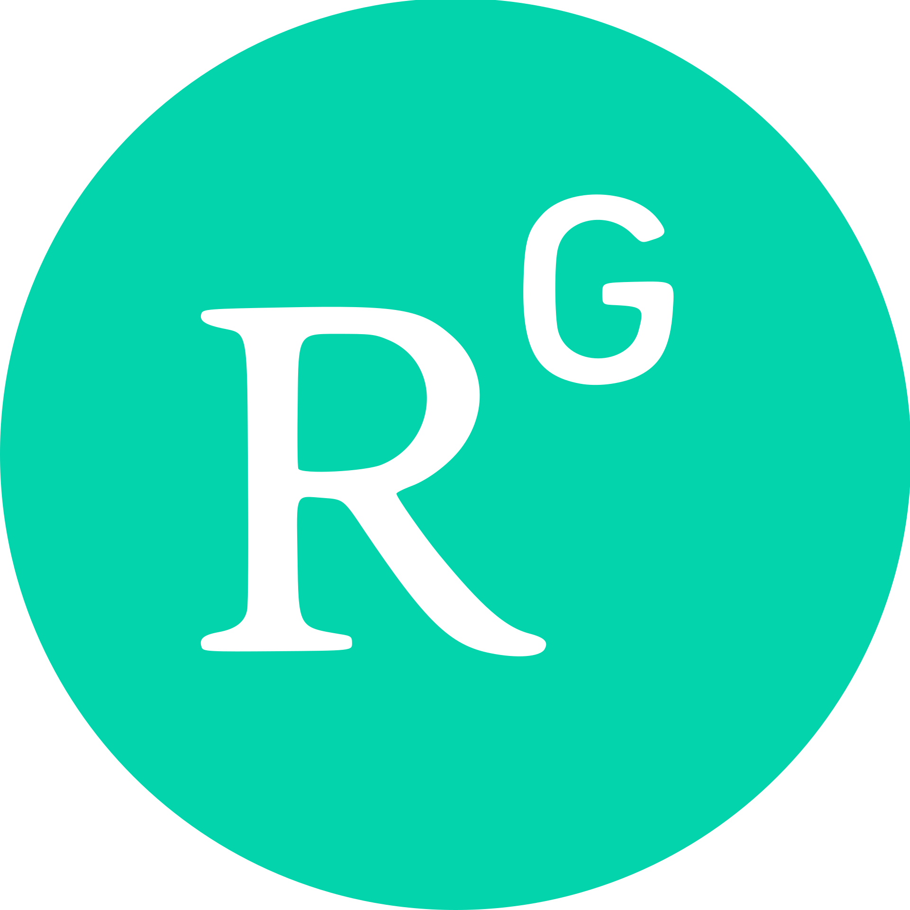

{: .profile-photo }
## Qi Tang 
Assistant Professor 
[School of Computational Science and Engineering](https://cse.gatech.edu) 
[Georgia Institute of Technology](https://www.gatech.edu/)

**Affiliations:**  
ML Ph.D. Program Faculty 
[ML Center at Georgia Tech (ML@GT)](https://ml.gatech.edu/) 

Guest Scientist 
[Los Alamos National Laboratory](https://www.lanl.gov/)

**Email:** [qtang@gatech.edu](mailto:qtang@gatech.edu) 
**Office:** Coda at Tech Square, E0562B
  

 
I am an Assistant Professor in [CSE](https://cse.gatech.edu/) at Georgia Institute of Technology. Prior to joining Georgia Tech, I was a Scientist in the Theoretical Division at Los Alamos National Laboratory (LANL). I am a computational scientist and applied mathematician by training, with a strong interest in physics, particularly **fusion energy** and **plasma physics**. I rely on open-source libraries such as [`MFEM`](https://mfem.org/), [`PETSc`](https://petsc.org/), [`AMReX`](https://amrex-codes.github.io/), [`p4est`](https://www.p4est.org/), [`Overture`](https://www.overtureframework.org/), and [`hypre`](https://hypre.readthedocs.io/) to develop scalable, high-performance numerical solvers. I also work on scientific machine learning (SciML) to enhance traditional solvers.

### Open Positions
We are hiring a **Postdoctoral Fellow** working at the interface of **machine learning, closure modeling, plasma turbulence and transport, and inertial or magnetic confinement fusion**. The position is part of [TEMPEST](https://tempest-stc.msu.edu/), a new NSF Science and Technology Center on turbulence prediction. We especially welcome candidates with a background in applied mathematics, computational science, physics, or AI for science. To apply, email me a single PDF with the subject line “Postdoc Inquiry — [Your Name]”, containing a cover letter (1–2 pages) describing your background and the research you would like to pursue, a CV, and contact information for two or three references. Applications are reviewed as they arrive, and the position remains open until filled.

I have several PhD student positions in Fall 2027. I primarily recruit through the College of Computing, including the CSE, ML, and CS programs. PhD students in the CSE and ML programs may have a home unit in a different school, so I also welcome students from math, physics, and engineering. Applicants must first be admitted by their respective home units. For students who are strongly interested in working with me, I encourage selecting the College of Computing as the home unit. **If you are interested in joining my group, please email me with your CV.**

### Research Interests
* **High-Performance Computing:** high-order schemes (finite difference/volume/element), particle-in-cell, scalable iterative solvers, preconditioning, adaptive mesh refinement, GPU accelerations
* **Scientific Computing and Simulation:** multiscale and multiphysics problems, fusion modeling, computational plasma physics
* **AI/ML and Data Science:** structure-preserving ML, dynamical system, neural operator, scale bridging, surrogate and model reduction, denoising, Bayesian inference

### Partnership 
* I am part of a 5-year NSF Science and Technology Center: Transformative Explorations in Multi-Physics and Engineering of Scientific Turbulence ([TEMPEST](https://tempest-stc.msu.edu/)).
* I am part of a 5-year NNSA PSAAP Focused Investigatory Center: Center for High Order Plasma Turbulence Modeling for Z-Pinch ([HighZ](https://highz-fic.github.io/)).
* I am part of a 5-year NNSA PSAAP Focused Investigatory Center: Center for Information Geometric Mechanics and Optimization ([CIGMO](https://cigmo.github.io/)).
* I am a thrust lead for a 5-year DOE ASCR MMICC: Center for Hierarchical and Robust Modeling of Non-Equilibrium Transport ([CHaRMNET](https://charmnet-mmicc.github.io/)). I lead two thrusts: multiscale modeling and runaway electron application.
* 2021–2025, I was the lead PI for a $3.5M DOE ASCR SciML project involving LANL, ANL, IIT, JHU, and PSU.
* 2018–2023, I was part of the DOE FES Tokamak Disruption Simulation SciDAC center ([TDS](https://tds-scidac.github.io/)).

### Awards

Summer Early Career ScholarKTH Royal Institute of Technology, <a href="https://www.digitalfutures.kth.se/">Digital Futures</a>

2026

DOE Early Career AwardOffice of Science, ASCR program

2025

 

