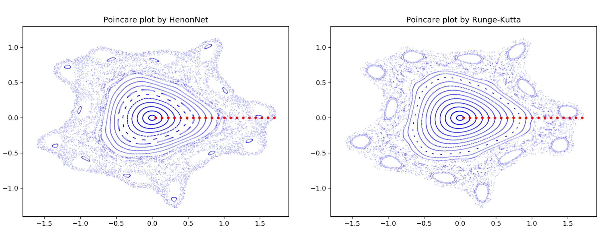

# Scientific machine learning

I have been increasingly interested in ML/AI, particularly in integrating mathematical and physical structures into neural networks. Therefore, I mainly focus on structure-preserving ML. Scientific machine learning (SciML) offers a promising approach to tackling problems where traditional numerical algorithms fall short. For instance, when designed properly, SciML can provide an alternative method for studying dynamical systems.

----

<b>The following structure-preserving SciML work has been primarily supported by DOE ASCR data-intensive scientific machine learning. </b>

## Structure-preserving SciML work

The recent representative papers include: dynamics learning for multiscale and/or stiff ODEs[^1] [^2] [^3] and large-scale PDEs,[^4] learning flow maps for Hamiltonians [^5] [^6], their applications,[^7] [^8] and molecular dynamics.[^9] [^10] 
Please refer to the corresponding references for more details. 

[^1]: D. Serino, A. Alvarez Loya, J. W. Burby, I. G. Kevrekidis, and Q. Tang. Fast-slow neural networks for learning singularly perturbed dynamical systems, **Journal of Computational Physics**, 537:114090, 2025.
[^2]: A. Alvarez Loya, D. Serino, J. Burby, and Q. Tang. Structure-preserving neural ordinary differential equations for stiff systems, _submitted_, 16 pages, 2025.
[^3]: Y. Lu, X. Li, C. Liu, Q. Tang, and Y. Wang. Learning generalized diffusions using an energetic variational approach, _submitted_, 23 pages, CiCP, 2024.
[^4]: A. J. Linot, J. W. Burby, Q. Tang, P. Balaprakash, M. D. Graham, and R. Maulik. Stabilized Neural Ordinary Differential Equations for Long-Time Forecasting of Dynamical Systems, **Journal of Computational Physics**, 474:111838, 2023.
[^5]: V. Duruisseaux, J. W. Burby, and Q. Tang. Approximation of Nearly-Periodic Symplectic Maps via Structure-Preserving Neural Networks, **Scientific Reports**, 13.1:8351, 2023.
[^6]: Y. Chen, W. Guo, Q. Tang, X. Zhong. Reduced-order modeling of Hamiltonian dynamics based on symplectic neural networks, _submitted_, 25 pages, 2025.
[^7]: E. G. Drimalas, F. Fraschetti, C.-K. Huang, and Q. Tang. Symplectic neural network and its applications to charged particle dynamics in electromagnetic fields, _in revision_, PoP, 16 pages, 2025.
[^8]: C.-K. Huang, Q. Tang, et al. Symplectic neural surrogate models for beam dynamics. **Journal of Physics: Conference Series**, 2687(6):062026, 2024.
[^9]: H. Tischler, W. Li, Q. Tang, D. Perez, and T. Vogel. Predicting atomistic transitions with transformers, _submitted_, 10 pages, 2025.
[^10]: S.-H. Wang, Y. Huang, J. M. Baker, Y.-E. Sun, Q. Tang, and B. Wang. A theoretically-principled sparse, connected, and rigid graph representation of molecules, **International Conference on Learning Representations (ICLR)**, 2025.

----

<b>The following fusion ML work has been primarily supported by DOE FES SciDAC and FES AI/ML programs. </b>

## Fast ML-based surrogates for fusion modeling

We have developed novel symplectic neural network (HenonNet) and applied it as a fast surrogate to generate Poincaré plot for tokamaks.[^11]
We also developed physics-assisted latent dynamics learning for collisional radiative models.[^12] [^13]
Please refer to the corresponding references for more details. 

[^11]: J. W. Burby, Q. Tang and R. Maulik. Fast neural Poincare maps for toroidal magnetic fields, **Plasma Physics and Controlled Fusion**, 63:024001, 2020.
[^12]: N. A. Garland, R. Maulik, Q. Tang, X.-Z. Tang and P. Balaprakash. Efficient data acquisition and training of collisional-radiative model artificial neural network surrogates through adaptive parameter space sampling, **Machine Learning: Science and Technology**, 3:045003, 2022.
[^13]: X. Xie, Q. Tang, and X.-Z. Tang. Latent space dynamics learning for stiff collisional-radiative models, **Machine Learning: Science and Technology**, 5:045070, 2024.

